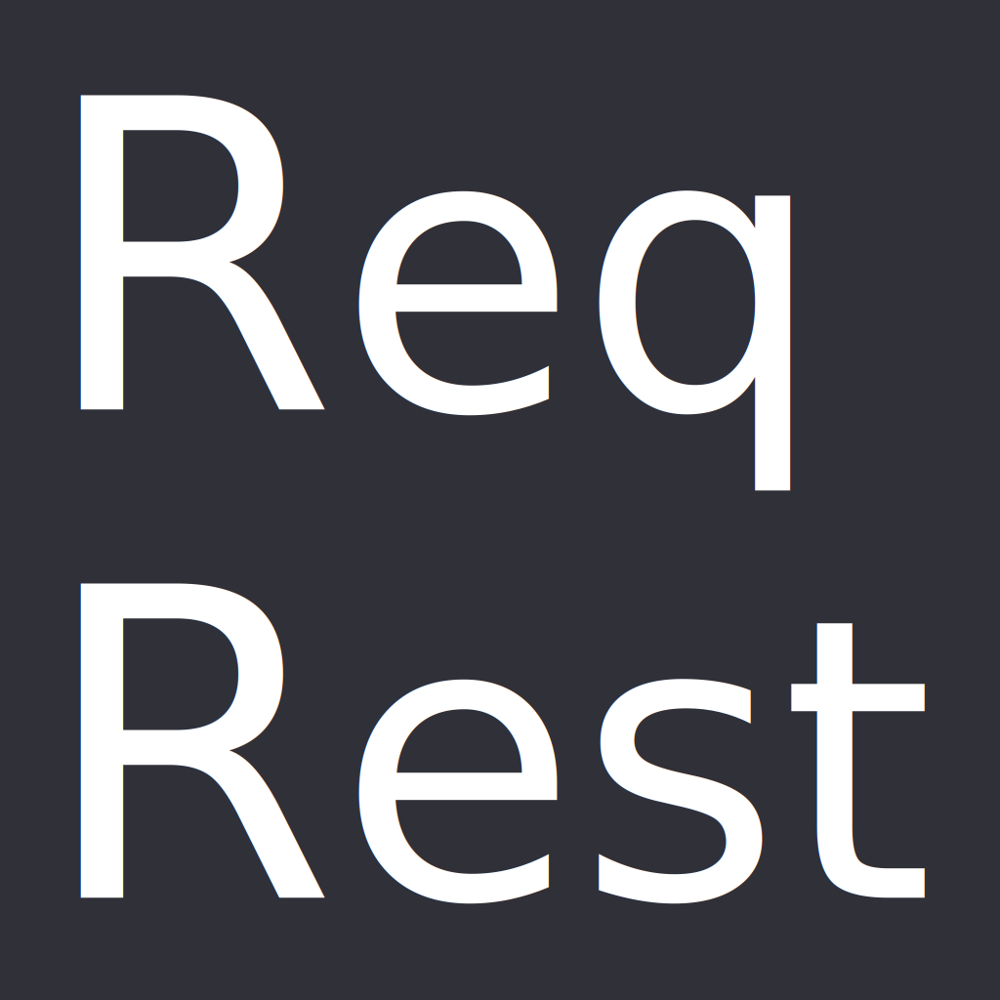
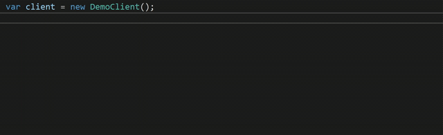

<h1 align="center">
  
</h1>
<h3 align="center">
  Build REST API Wrappers with Ease
</h3>

<div align="center">
    
[](https://dev.azure.com/ManuelRoemer/ReqRest/_build/latest?definitionId=12&branchName=master)   

[Getting Started](https://reqrest.github.io/articles/getting-started.html) &nbsp; | &nbsp; [Guides](https://reqrest.github.io/articles/guides/index.html) &nbsp; | &nbsp; [API Documentation](https://reqrest.github.io/api/) &nbsp; | &nbsp; [Changelog](./CHANGELOG.md) &nbsp; | &nbsp; [NuGet](https://www.nuget.org/packages/ReqRest/)

> **Note:** This repository's default branch is the `dev` branch. Switch to `master` for the latest release.

</div>

# What is ReqRest? 

ReqRest allows you to easily turn a RESTful Web API into a **fully typed** C# library by using a **declarative, fluent** syntax.
API clients written with ReqRest have full IntelliSense and compiler support and thus feel like plain C#. 



> An example API client demonstrating ReqRest's IntelliSense support.


## What is ReqRest?

At its core, ReqRest allows you to build fully typed REST API Clients.
Let's assume that we want to wrap a REST API which, amongst others, offers the following endpoint.

| Endpoint | Status Code | Response |
| -------- | ----------- | -------- |
| `/todos` | `200`     | All TodoItem(s): <br/> `[ { "title": string } ]` |
|          | `400-599` | Error description: <br/> `{ "message": string }` |

By using ReqRest, you can create a fully typed API Client which allows you to project the REST API into plain C#:

```csharp
var client = new DemoClient();

// Make a request to get all Todo resources of the user with the ID 1.
var resource = await client.Todos().Get().FetchResourceAsync();

// One of ReqRest's greatest strenghts is that it makes REST APIs feel like C#.
// You won't have to deal with status codes anymore.
// Depending on what the API returns, ReqRest automatically parses the correct response type and
// then lets you continue the work with it.
//
// The Match(...) is one way of doing this. There also other methods to do the same, for example TryGetValue<T>(...).
resource.Match(
    todoItems => Console.WriteLine($"There are {todoItems.Count()} todo items! First: {todoItems.First().Title}"),
    error     => Console.WriteLine($"Received an error: {error.Message}."),
    ()        => Console.WriteLine($"Received an entirely different status code.")
);
```

The code which is required to recreate this example is minimal (DTO classes are removed for brevity).

```csharp
class DemoClient : RestClient
{
    public DemoClient() : base(new RestClientConfiguration() { BaseUrl = new Uri("http://demo-api.com") }) { }

    public TodosInterface Todos() =>
        new TodosInterface();
}

class TodosInterface : RestInterface
{
    public TodosInterface(RestClient restClient) : base(restClient) { }
    
    // 'baseUrl' is, in this case, the 'BaseUrl' from the configuration above.
    // The '/' operator simply joins the two URL parts to the following: http://demo-api.com/todos
    // Any request created by this class (e.g. the Get() request created below) uses the URL which is built here.
    protected override UrlBuilder BuildUrl(UrlBuilder baseUrl) =>
        baseUrl / "todos";
    
    // The task of a RestInterface class is the creation of requests to that interface.
    // ReqRest follows a declarative approach.
    // You state what the API returns for which status code and ReqRest does everything else for you.
    public ApiRequest<IList<TodoItem>, Error> Get() =>
        BuildRequest()
            .Get()
            .Receive<IList<TodoItem>>().AsJson(forStatusCodes: 200)
            .Receive<Error>().AsJson(forStatusCodes: (400, 599)); // All status codes from 400 to 599.
}
```

The example above displays the most important features of ReqRest.
This is a very simple example, but ReqRest also supports more complex scenarios.
For example, a fictional endpoint like `POST /users/123/todos` can easily be wrapped with ReqRest, resulting in the following code:
`client.Users(123).Todos().Post(new TodoItem(...))`.

This is not everything though. All in all, ReqRest provides a lot of features which will make your life easier
when interacting with REST APIs.

For a thorough overview, read through the documentation and advanced examples or have a look at the example projects.


## Installation

The library is available on NuGet. Install it via:

```sh
Install-Package ReqRest
Install-Package ReqRest.Serializers.NewtonsoftJson # Optional, but desired in most cases.

--or--

dotnet add package ReqRest
dotnet add package ReqRest.Serializers.NewtonsoftJson # Optional, but desired in most cases. 
```

While `ReqRest` is the main package which you will want to install in 99.9% of cases,
the whole library is split into multiple packages from which you can choose:

| Package Name                         | NuGet Version | Description |
| ------------------------------------ | ------------- |------------ |
| `ReqRest`                            |  | The main package which contains the required members to wrap a RESTful HTTP API. |
| `ReqRest.Builders`                   |  | Provides builders and builder extension methods which enable fluent configuration of classes like `HttpRequestMessage`. |
| `ReqRest.Http`                       |  | Contains constants and members that are missing from `System.Net.Http`. |
| `ReqRest.Serializers`                |  | Provides the base members for serializers that are used by the library. |
| `ReqRest.Serializers.NewtonsoftJson` |  | Provides a JSON (de-)serializer and integration methods for the `ReqRest` package. Uses the `Newtonsoft.Json` for the JSON (de-)serialization. |


## Getting Started

A documentation is in the process of being written.
You can view the documentation [here](https://ReqRest.github.io).

While the documentation is incomplete, you can have a look at `src/DemoApplication` in this repository.
In there, you can find a functional demo app which uses ReqRest to wrap the [JSON Placeholder](https://jsonplaceholder.typicode.com/)
API.
I recommend to look at the following files (in order) and then just follow the comments:

* `Program.cs`
* `JsonPlaceholderClient.cs`
* `TodosInterface.cs`
* `TodoInterface.cs`


## Versioning

As long as the library is still in the initial development (i.e. on version `0.x.x`) any
version increment may signify a breaking change.
Large changes will definitly lead to a minor version increment.
Small breaking changes may only increment the patch number though.

As soon as the library reaches version `1.0.0` it will follow Semantic Versioning.


## Contributing

Any kind of contribution is welcome! Be sure to submit bugs and feature requests via GitHub issues.

Before starting to write code for a (larger) Pull Request, be sure to talk about the changes that
you are going to make, so that we can ensure that the changes are going to have a chance of being 
accepted.


### Git and CI

Development is done in separate branches. Once changes are done, they will be merged into the
`dev` branch.

Once there are enough changes to justify a new library version, `dev` will be merged into `master`
and published.
As a result, `master` always represents the state of the latest release. 


## License

See the [LICENSE](./LICENSE) file for details.
